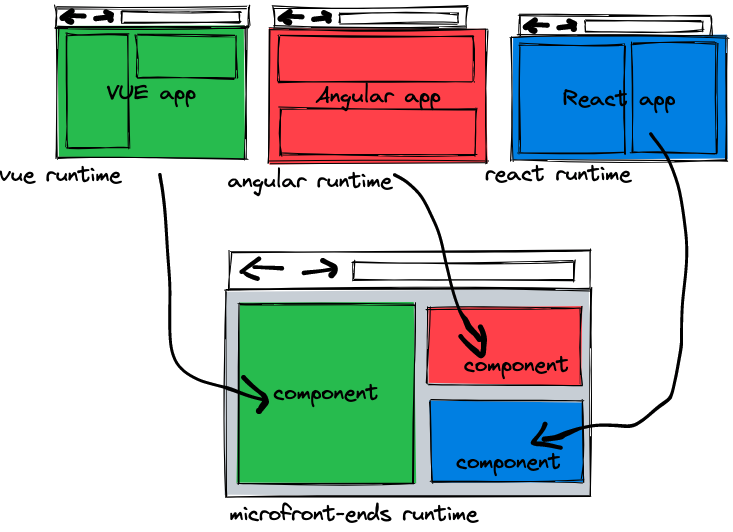

# tiny micro-frontend framework idea validation

1. using shadow dom to isolate css
2. using iframe to isolate js



# todo

0. [x] true isloation between different apps
1. [ ] routing work
2. [ ] loading url with js and css in sandbox

# how to dev

use any liveload tools to serve myframework folder

```
cd myframework
livehttp

```


